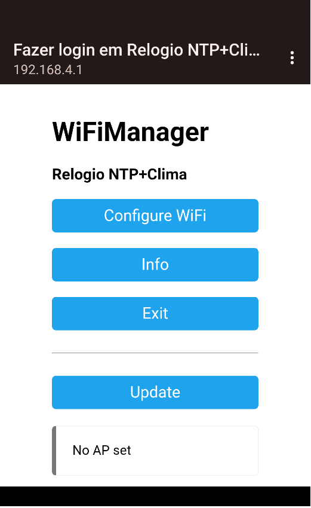
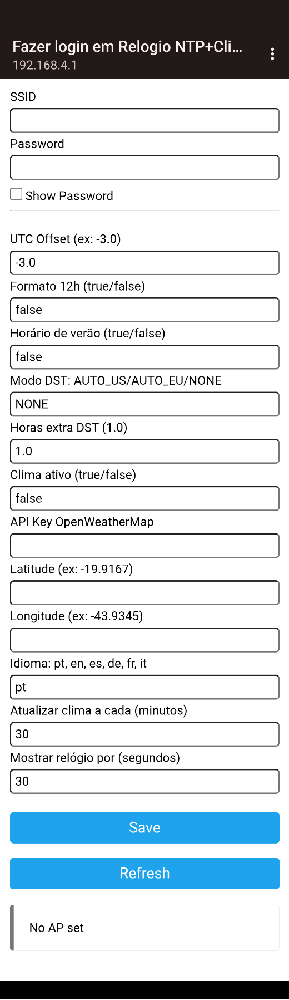
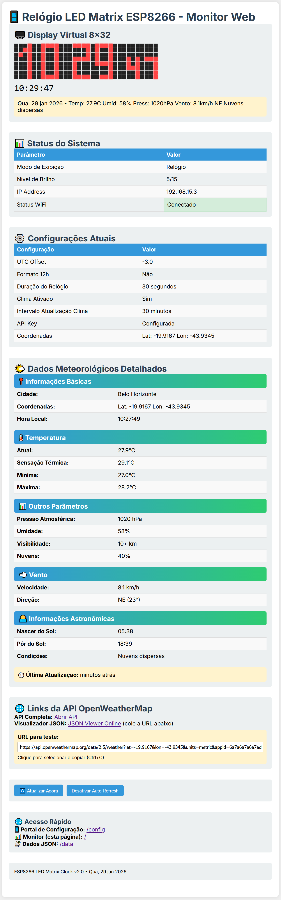

# ESP8266 LED Matrix Clock with Weather & Web Monitor

Um relógio inteligente baseado em ESP8266 com matriz LED 8x32,
sincronização NTP, informações meteorológicas, controle automático de
brilho e **monitoramento web completo**.

[](https://img.shields.io/badge/ESP8266-LED%20Matrix%20Clock-blue)
[](https://img.shields.io/badge/Vers%C3%A3o-2.0-green)
[](https://img.shields.io/badge/Licen%C3%A7a-MIT-orange)
[](https://img.shields.io/badge/Web%20Monitor-Simulado%208x32-brightgreen)

## 🖼️Interface Gráfica

<div align="left">
  <div style="display: flex; flex-wrap: wrap; justify-content: center; gap: 20px;">
    
    
    
  </div>
  <p><em>Visão completa da interface</em></p>
</div>


# 📋 Características Principais

## 🕒 Relógio Inteligente
- Sincronização automática via NTP (Network Time Protocol)
- Formato 12h ou 24h configurável
- Animação suave de transição dos dígitos
- Exibição de segundos com fonte menor
- Controle automático de brilho baseado no horário

## 🌤️ Sistema Meteorológico
- Integração com OpenWeatherMap API
- Exibição de temperatura, umidade, pressão e vento
- Descrição das condições climáticas
- Atualização automática periódica
- Conversão automática de direção do vento (graus para pontos cardeais)

## 📅 Informações de Data
- Exibição formatada: "Qua, 21 jan 2026"
- Alternância automática entre relógio e informações
- Scroll suave das informações completas
- String unificada que combina data e informações do clima

## 🌐 Monitor Web Avançado
- **Display Virtual 8x32** que simula exatamente a matriz LED física
- Atualização em tempo real dos pixels ativos
- Página web responsiva e moderna com visualização completa do sistema
- Auto-refresh configurável (ativa/desativa)
- Status detalhado do sistema em formato de tabela
- Dados meteorológicos atualizados
- Acesso rápido às configurações

## ⚙️ Sistema de Configuração
- Portal WiFi integrado para configuração
- Contador regressivo visual (10 segundos) para acesso ao modo configuração
- Configurações salvas em EEPROM
- Fácil reconfiguração via botão físico
- Servidor web embutido com páginas de configuração

# 🛠️ Hardware Necessário

**Componentes**
- ESP8266 (ESP-01S ou NodeMCU ESP-12E)
- Matriz LED 8x32 (4 módulos MAX7219 8x8 em cascata)
- Fonte de alimentação 5V (1A mínimo)
- Botão momentary para configuração
- Cabo USB para programação

**Pinagem ESP-01S**

| **Pino ESP-01S** | **Função** | **Conexão Matriz LED** |
| :--- | :--- | :--- |
| GPIO2 | DIN | Data In |
| GPIO3 (RX) | CS | Chip Select |
| GPIO0 | CLK | Clock |
| GPIO1 (TX) | Botão Configuração | Botão → GND |

**Pinagem NodeMCU ESP-12E (Alternativa)**

| **Pino NodeMCU** | **Função** | **Conexão Matriz LED** |
| :--- | :--- | :--- |
| D8 (GPIO15) | DIN | Data In |
| D7 (GPIO13) | CS | Chip Select |
| D6 (GPIO12) | CLK | Clock |
| D4 (GPIO2) | Botão Configuração | Botão → GND |

# 📦 Instalação

## 1. Preparação do Ambiente

```bash
# Instalar Arduino IDE
# Adicionar URL do ESP8266 no Gerenciador de Placas:
# http://arduino.esp8266.com/stable/package_esp8266com_index.json

# Instalar bibliotecas necessárias via Library Manager:
# - WiFiManager by tzapu
# - ArduinoJson by Benoit Blanchon (versão 5.x)
# - NTPClient by Fabrice Weinberg
# - ESP8266WebServer (já incluída no core)
```
## 2. Configuração do Código

1. Clone este repositório ou faça download dos arquivos
2. Abra ESP8266_8x32_Matrix_NTP_Portal_v07.ino no Arduino IDE
3. Inclua os arquivos max7219_final.h e new_fonts.h no mesmo diretório
4. Selecione a placa apropriada:
- Para ESP-01S: Generic ESP8266 Module
- Para NodeMCU: NodeMCU 1.0 (ESP-12E Module)

### 3. Configurações da Placa
1. Para ESP-01S:
- Flash Mode: DIO
- Flash Size: 1MB (FS:64KB OTA:~470KB)
- CPU Frequency: 80 MHz
- Upload Speed: 115200
- Port: Selecione a porta COM correta

2. Para NodeMCU:
- Flash Size: 4MB (FS:3MB OTA:~512KB)
- CPU Frequency: 80 MHz
- Upload Speed: 115200
- Port: Selecione a porta COM correta

## 4. Compilação e Upload
- Conecte o ESP8266 via USB
- Selecione a porta COM correta
- Clique em Upload
- Aguarde a compilação e transferência

### 🔧 Configuração Inicial
## Primeira Execução
- Após o upload, o ESP iniciará mostrando "BOOT"
- Em seguida, aparecerá um contador regressivo de 10 segundos
- Opção A: Pressione o botão durante o contador para modo configuração
- Opção B: Aguarde o contador terminar para modo automático

# ⚙️ Portal de Configuração
## Portal de Configuração
- Se escolher modo configuração:
- Conecte-se ao WiFi "Relogio NTP+Clima"
- Abra o navegador em 192.168.4.1
- Configure os parâmetros:

# 🕒 Parâmetros do Relógio:
## Parâmetros do Relógio:
- UTC Offset: Fuso horário (ex: -3.0 para Brasília)
- Formato 12h: true/false para formato 12 ou 24 horas
- Horário de verão: true/false
- Modo DST: AUTO_US/AUTO_EU/NONE
- Horas extra DST: (padrão: 1.0)
- Mostrar relógio por: Segundos de exibição do relógio (padrão: 30)

## Parâmetros do Clima (Opcional):
- Clima ativo: Habilitar/desabilitar sistema meteorológico
- API Key OpenWeatherMap: Sua chave de API gratuita
- Latitude/Longitude: Coordenadas da sua localização
- Idioma: pt, en, es, de, fr, it
- Atualizar clima a cada: Minutos entre atualizações (padrão: 30)

# 🌐 Monitor Web
## Acesso ao Monitor
- Após a configuração inicial, o ESP exibirá seu IP local
- Abra um navegador e acesse: http://[IP_DO_ESP]
- Exemplo: http://192.168.1.100

### Funcionalidades do Monitor Web
## 🖥️ Display Virtual 8x32
- Representação exata da matriz LED física
- Cada pixel mostra seu estado atual (ligado/desligado)
- Tooltip com informações técnicas (coluna, linha, valor do byte)
- Atualização automática a cada segundo

## 📊 Status do Sistema
- Modo de exibição atual (Relógio ou Scroll Info)
- Nível de brilho atual (0-15)
- Endereço IP local
- Status da conexão WiFi
- Informações detalhadas das configurações ativas

## 🌤️ Dados Meteorológicos
- Temperatura atual em °C
- Umidade relativa do ar
- Pressão atmosférica
- Velocidade e direção do vento
- Descrição das condições climáticas
- Tempo desde a última atualização

## ⚙️ Configurações Atuais
- UTC Offset configurado
- Formato de hora (12h/24h)
- Duração da exibição do relógio
- Status do sistema de clima
- Intervalo de atualização do clima
- Status da API Key
- Coordenadas geográficas configuradas

### Controles Interativos
- Atualizar Agora: Atualiza manualmente todos os dados
- Auto-Refresh: Liga/desliga a atualização automática (padrão: ligado)
- Acesso Rápido: Links para configuração, monitor e dados JSON

### Acesso Rápido
- / - Monitor principal (esta página)
- /config - Página de configuração simplificada
- /data - Dados em formato JSON para integração
- /update - Endpoint para atualizar configurações via POST

# 🌟 Funcionamento
## Fluxo Normal de Operação
1. Relógio animado por X segundos (configurável no portal)
2. Scroll com informações: Data + Clima (se habilitado)
3. Retorno automático ao relógio
4. Repete infinitamente este ciclo

## Controle de Brilho Automático
O brilho ajusta automaticamente conforme o horário:

| **Período** | **Horário** | **Brilho** | **Descrição** |
| :--- | :--- | :--- | :--- |
| Noite	| 22:00-05:59	| 1	| Muito baixo |
| Madrugada	| 06:00-06:59	| 3	| Baixo |
| Manhã	| 07:00-10:59	| 5	| Médio-baixo |
| Dia	| 11:00-15:59	| 8	| Médio (padrão) |
| Tarde	| 16:00-17:59	| 6	| Médio |
| Noite Inicial	| 18:00-21:59	| 4	| Médio-baixo |

# Formato da Informação
## Exemplo com clima habilitado:
```bash
"Qua, 21 jan 2026 - Temp: 25.5C Umid: 65% Press: 1013hPa Vento: 12.3km/h N Nublado"
```
## Exemplo sem clima:
``` bash
"Qua, 21 jan 2026"
```
## Sistema de Scroll
- Velocidade ajustável: 80ms por frame
- Passo do scroll: 2 pixels por frame
- Espaçamento automático entre caracteres
- Transição suave com espaços no início/fim

# 🎨 Fontes e Display

## Fontes Utilizadas
- Relógio principal: dig4x8 (números médios - horas e minutos)
- Segundos: dig3x5 (números pequenos)
- Texto geral: font_emr (ASCII completo para scroll)
- Contador regressivo: dig4x8

## Sistema de Animação do Relógio
- Transição suave entre dígitos (animação de 8 frames)
- Posicionamento otimizado: HH:MM:ss
- Pontos (:) piscam a cada segundo
- Atualização a cada 40ms para animação fluida

# 🔄 Reconexão e Atualização
## Sincronização NTP
- Atualização automática a cada hora
- Fallback para hora interna se perder conexão
- Ajuste automático para fuso horário
- Suporte a horário de verão (DST)

## Atualização do Clima
- Consulta API OpenWeatherMap periodicamente
- Cache dos dados entre atualizações
- Fallback para apenas data se falhar conexão
- Suporte a múltiplos idiomas

## Reconexão WiFi
- Tentativa automática de reconexão
- Mantém configurações salvas em EEPROM
- Log visual no display se necessário
- Fallback para modo AP após falhas

# 🛠️ Solução de Problemas

# Problemas Comuns

### Display não acende
- Verifique conexões dos pinos
- Confira alimentação 5V estável
- Teste com brilho máximo temporário
- Verifique se os módulos MAX7219 estão em cascata corretamente

### Não conecta ao WiFi
- Reinicie para acessar portal configuração
- Verifique senha do WiFi
- Confira força do sinal
- Verifique se o ESP está muito longe do roteador

### Hora incorreta
- Verifique UTC Offset no portal
- Confira conexão com internet
- Aguarde sincronização NTP (até 1 hora)
- Verifique configurações de horário de verão

### Clima não aparece
- Verifique se clima está habilitado no portal
- Confira API Key do OpenWeatherMap
- Verifique coordenadas geográficas
- Confira conexão com internet

### Monitor Web não carrega
- Verifique se o IP está correto
- Confira se o ESP está conectado à rede
- Tente reiniciar o ESP
- Verifique firewall/blockers do navegador

### Contador regressivo não aparece
- Verifique conexão do botão no pino correto
- Confira se o botão está funcionando
- Aguarde o "BOOT" terminar
- Verifique se há pull-up interno ativo

## Modo de Recuperação

### Para forçar modo configuração:
- Mantenha botão pressionado durante reinicialização
- Aguarde contador regressivo aparecer
- Solte botão durante contador
- Acesse portal WiFi conforme instruções

### Para redefinir configurações:
- Acesse o monitor web (http://[IP_DO_ESP])
- Clique em "Configuração" no menu de acesso rápido
- Ajuste os parâmetros necessários
- Clique em "Salvar Configurações"

# 📁 Estrutura de Arquivos
```bash
ESP8266_LED_Matrix_Clock_v2.0/
│
├── ESP8266_8x32_Matrix_NTP_Portal_v07.ino # Código principal
├── max7219_final.h # Driver da matriz LED
├── new_fonts.h # Fontes personalizadas
├── README.md # Este arquivo
└── LICENSE # Licença MIT
```

# ⚡ Otimizações
## Para Produção
- Delay mínimo no loop principal (50ms)
- Verificações periódicas eficientes
- Controle de memória otimizado
- Conexões HTTP fechadas adequadamente

## Consumo de Energia
- Brilho adaptativo reduz consumo significativamente
- Processamento otimizado sem delays desnecessários
- Conexões WiFi apenas quando necessário
- Servidor web leve e eficiente

# 🔧 Personalização
## Ajuste de Horários do Brilho
Para modificar os horários do controle de brilho, edite a função getCurrentPeriod() no código:
```bash
BrightnessPeriod getCurrentPeriod() {
    int currentHour = h;
    if (currentHour >= 22 || currentHour < 6) {
        return PERIOD_NIGHT; // 22:00 - 05:59
    } else if (currentHour >= 6 && currentHour < 7) {
        return PERIOD_DAWN; // 06:00 - 06:59
    } else if (currentHour >= 7 && currentHour < 11) {
        return PERIOD_MORNING; // 07:00 - 10:59
    } else if (currentHour >= 11 && currentHour < 16) {
        return PERIOD_DAY; // 11:00 - 15:59
    } else if (currentHour >= 16 && currentHour < 18) {
        return PERIOD_AFTERNOON; // 16:00 - 17:59
    } else if (currentHour >= 18 && currentHour < 22) {
        return PERIOD_EVENING; // 18:00 - 21:59
    }
    return PERIOD_DAY; // Default
}
```
## Ajuste de Valores de Brilho
Para modificar os níveis de brilho, edite a constante DEFAULT_BRIGHTNESS:
```bash
const BrightnessConfig DEFAULT_BRIGHTNESS = {
    1, // Noite: muito baixo
    3, // Madrugada: baixo
    5, // Manhã: médio-baixo
    8, // Dia: médio (padrão)
    6, // Tarde: médio
    4  // Noite inicial: médio-baixo
};
```
## Personalização do Monitor Web
O monitor web está totalmente contido no código principal. Para personalizar:

1. Edite a função getHTML() para modificar o layout
2. Ajuste o CSS dentro da string HTML
3. Modifique o JavaScript para adicionar funcionalidades
4. Atualize os endpoints do servidor se necessário

## Adicionar Novos Parâmetros
Para adicionar novas configurações:
1. Adicione à estrutura Settings
2. Atualize as funções loadDefaultSettings(), applySettingsFromEEPROM(), etc.
3. Adicione parâmetros ao WiFiManager
4. Atualize a página web se necessário

# 📄 Licença

Este projeto está licenciado sob a Licença MIT - veja o arquivo LICENSE para detalhes.

# 👥 Créditos
- Autor: Ezequiel M Rezende
- Data: 2026/01/02
- Versão: 2.0 com Monitor Web
- Baseado em: Projetos open-source de matriz LED e ESP8266
- Fontes: Conjunto personalizado otimizado para matriz 8x8
- Web Interface: Design responsivo com display virtual 8x32

# 🤝 Contribuições
Contribuições são bem-vindas! Por favor:
1. Fork o projeto
2. Crie uma branch para sua feature (git checkout -b feature/AmazingFeature)
3. Commit suas mudanças (git commit -m 'Add some AmazingFeature')
4. Push para a branch (git push origin feature/AmazingFeature)
5. Abra um Pull Request

# 🌐 Links Úteis
- OpenWeatherMap API - Obtenha sua API Key gratuita
- ESP8266 Arduino Core - Core do ESP8266 para Arduino
- MAX7219 Datasheet - Datasheet do controlador LED
- WiFiManager Library - Biblioteca para gerenciamento WiFi
- ArduinoJson Library - Biblioteca para manipulação JSON
- NTPClient Library - Cliente NTP para Arduino

# 📞 Suporte
Se você encontrar problemas ou tiver perguntas:
1. Verifique a seção Solução de Problemas
2. Revise as configurações no portal WiFi
3. Consulte as Issues do projeto (se disponível)
4. Crie uma nova issue se o problema persistir

### Nota: 
Este projeto foi otimizado para produção com foco em estabilidade e eficiência. O monitor web foi projetado para ser leve e responsivo, consumindo mínimo de recursos do ESP8266.

### Dica para Desenvolvimento:
Para depuração, mensagens Serial estão habilitadas na porta 74880. Para produção, considere remover ou reduzir os Serial.println() para melhor performance.

---
Aproveite seu relógio inteligente com monitoramento web! 🎉
---

Última atualização: Janeiro 2026
Versão do Software: 2.0 (com Monitor Web)
*Compatível com: ESP-01S, NodeMCU ESP-12E*
*Requisitos: Arduino IDE 1.8+, ESP8266 Core 2.7.4+*
